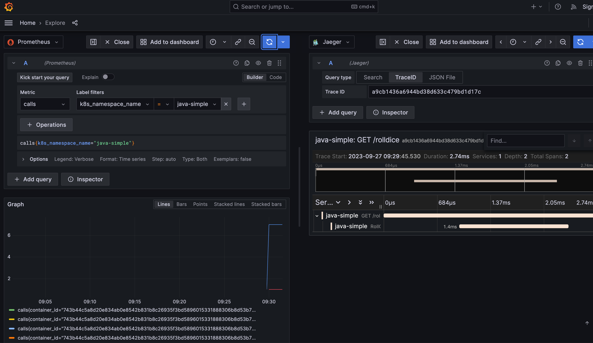

# otel-java-simple

### Idea
The idea of this repository is :
- Create a java application with auto-instrumentation. Based in [java-simple](https://opentelemetry.io/docs/instrumentation/java/getting-started/#example-application)
- Deploy the application inside kubernetes cluster (I've choose [k3d](https://github.com/k3d-io/k3d))
- Deploy observability components (jaeger + prometheus + grafana + otel-collector)
- Deploy [opentelemetry demo](https://opentelemetry.io/docs/demo/kubernetes-deployment/)

### How to play
From the premise that you have a kubernetes cluster up and running, lets see how to get access in everyhing.

#### java-simple
- **Build locally**
```bash
$ docker build --tag java-simple .
```
- **Deploy on k8s**
```bash
$ kubectl create ns java-simple
$ kubens java-simple 
$ k apply -f kubernetes/deploy-app.yaml
```

- **Deploy otel-demo**
```bash
$ kubectl create ns otel-collector
$ kubens otel-collector 
$ k apply -f kubernetes/deploy-otel-demo.yaml
```

- **Run**

Expose the application:
```bash
$ k port-forward deploy/java-simple-deployment 8080 -n java-simple
```

Roll the dice via api:
```bash
$ curl http://localhost:8080/rolldice
```

#### grafana
- **Expose grafana**
```bash
$ k port-forward deploy/opentelemetry-demo-grafana 3000 -n otel-collector
```

Access to grafana via browser:
```
http://localhost:3000/grafana/
```

- **Check metrics and trace**


